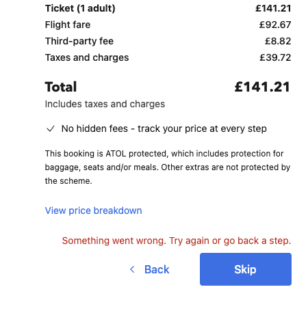

# UI Test Automation - Tech Test

# Introduction
I have created two tests that test the Booking.com flight booking flow. The two scenarios are
* Scenario: Attempt to book a flight from London Heathrow to Edinburgh
* Scenario: Attempt to search for flights where both the origin and destination airports are the same

### Tools
* Java
* Cucumber


## Framework
I've crafted these tests using the BDD format, structured around the Given, When, Then pattern. Additionally, I've 
adopted the Page Object design paradigm, where each UI page is represented by a dedicated Java class. As a result, all 
conceivable user interactions on a specific page are encapsulated within the corresponding Java class.

These tests are deliberately kept elementary, focusing on essential user journeys. Ideally, they would also incorporate 
further validations as part of the journey. For instance, a validation could involve checking whether adding a checked 
bag appropriately raises the total flight cost to reflect the bag's price increase.

### Example Test Scenario
```gherkin
Scenario: Book a flight using valid airports
    Given I want to fly from LHR
    And I want to fly to EDI
    When I search for flights
    And I select the 1st flight
    And I enter in my contact details
    |firstname |lastname |email         |mobile     |gender|dob          |
    |mickey    |mouse    |micky@test.com|07711111111|male  |01-March-1990|
    And I add a checked bag
    Then I should be asked to select my seat
```
* You can provide any airport code for the first two steps
* when selecting a flight (step 4) you can select the 2nd, 3rd, 4th etc flight

### Running Tests
Tests can be run using Maven
```shell
mvn clean test
```


### Note
Kindly observe that the initial scenario is the most comprehensive. Nonetheless, I've halted the test progression at 
the "Select Seat" page due to encountering the subsequent UI error.
<p >
  
</p>
Looking at the response received from the back-end, I can see the error

```json
{
    "error": {
        "code": "CART_MANAGEMENT_INITIALIZEORDER_FAILED_TO_UPDATE_ETG_CART",
        "requestId": "6da362f0-4282-11ee-8142-bdb8e1a3c89d"
    }
}
```
Furthermore, I'm uncertain whether proceeding beyond this page in the journey would result in reserving my seats on 
the flight for a specific duration, potentially obstructing others who genuinely intend to book seats.


